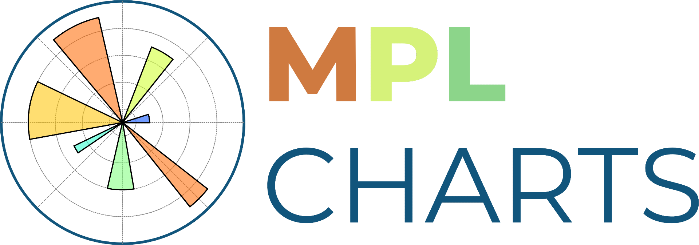
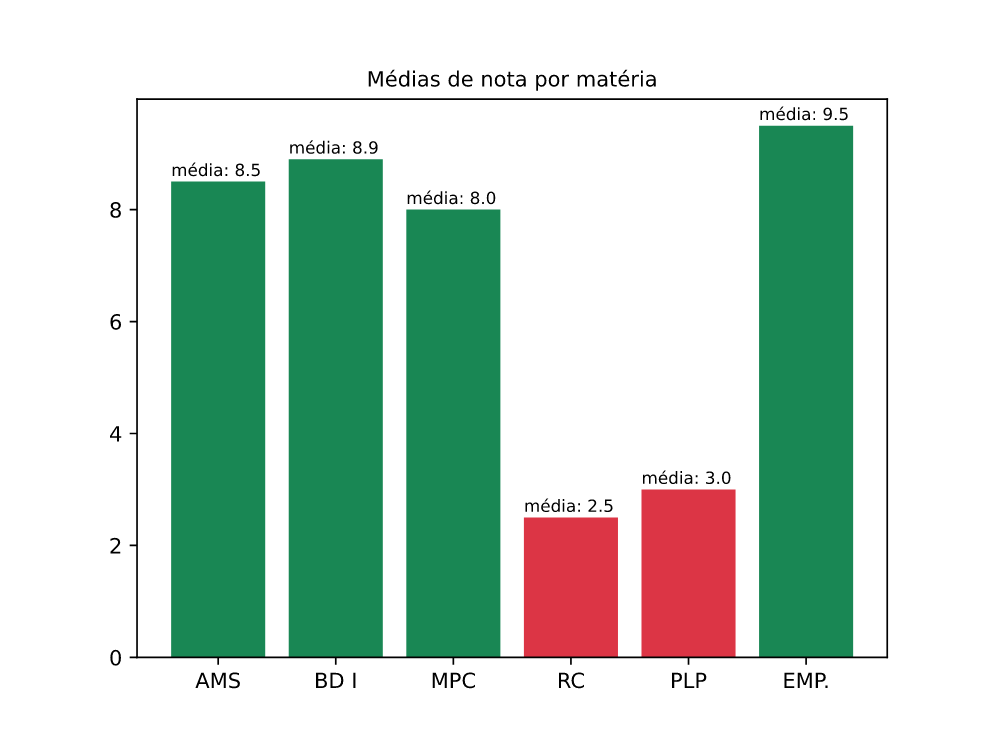
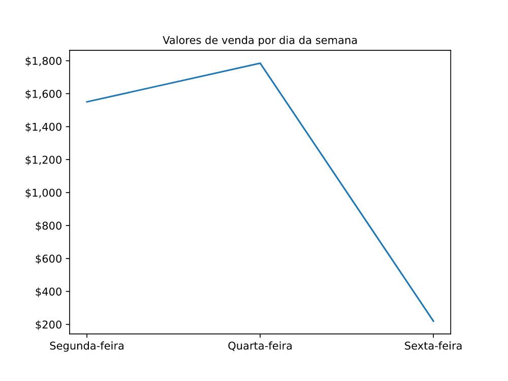
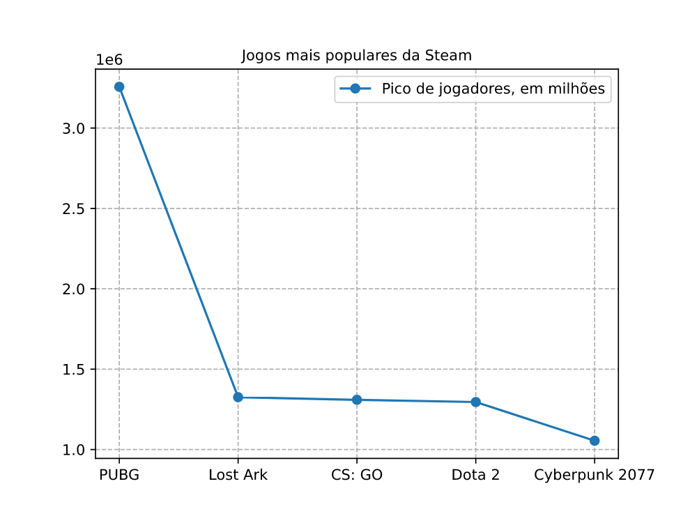
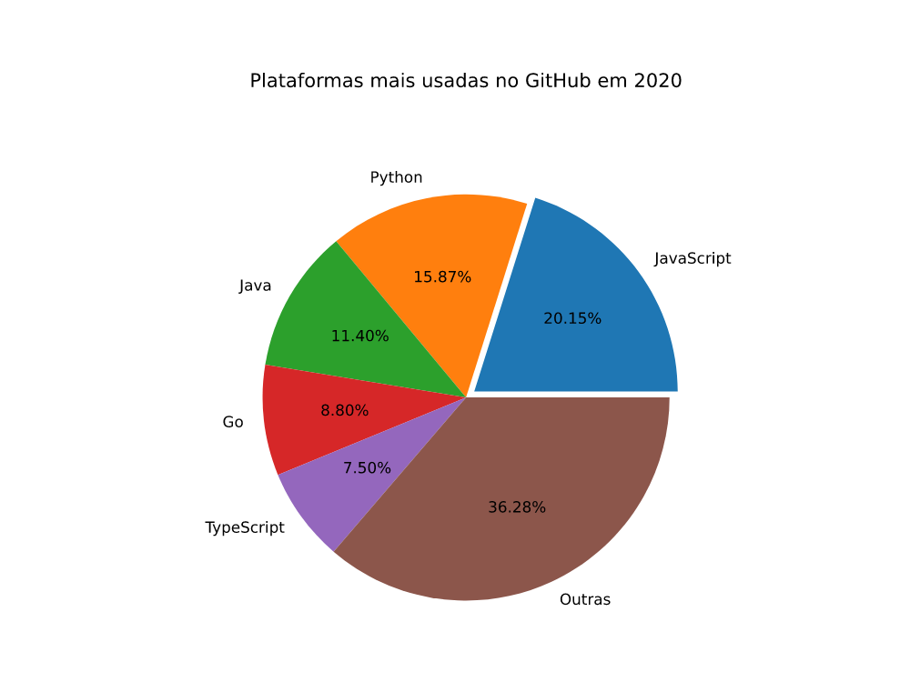
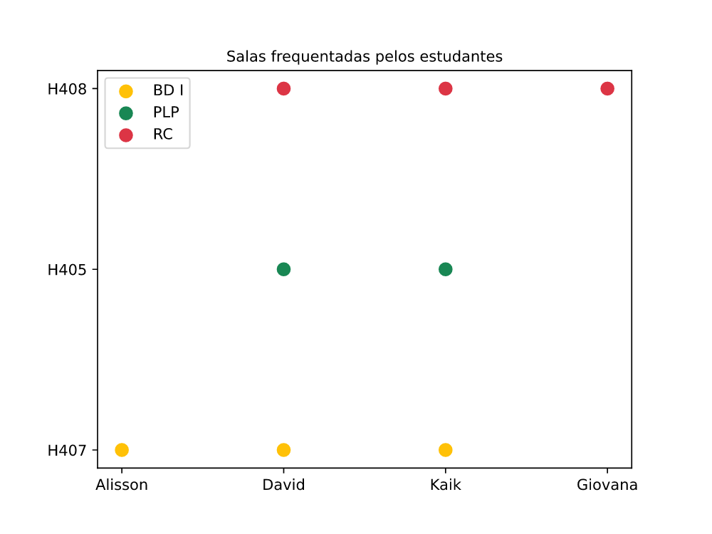

<p align="center">
  
</p>
<br>

## 1. Sobre
<div align="justify">
    (PT-BR) Matplotlib Charts é um projeto desenvolvido em Python com as bibliotecas Matplotlib, Numpy e Pandas voltado para a análise de dados, em que é possível
    observar gráficos e os níveis de alternância entre os valores dispostos. Um fator relevante a respeito do projeto é a implementação do paradigma de orientação
    a objetos, padrão pouco usual na linguagem Python; sendo assim, fez-se necessário a importação de bibliotecas complementares como a Abstract Base Classes (ABC),
    para a incorporação de classes abstratas, além da Overrides, que auxilia na visualização de métodos caracterizados pela sobrescrita de métodos herdados pela
    classe abstrata. Ademais, é válido dizer que a interação ocorre essencialmente através do terminal com a devida formatação dos textos e mensagens advindas da
    interação com o sistema.
    <br><br>
    (EN-US) Matplotlib Charts is a project developed in Python with the Matplotlib, Numpy, and Pandas libraries aimed at data analysis, where it is possible to 
    observe charts and the levels of alternation between the arranged values. A relevant factor about the project is the implementation of the object-oriented 
    paradigm, an uncommon pattern in the Python language; therefore, it was necessary to import complementary libraries such as the Abstract Base Classes (ABC) 
    for the incorporation of abstract classes, as well as the Overrides, which helps in the visualization of methods characterized by the override of inherited 
    methods from the abstract class. Furthermore, it is worth mentioning that the interaction essentially occurs through the terminal with the proper formatting 
    of texts and messages arising from the interaction with the system.
</div>
<br><br>

## 2. Versões utilizadas
<table>
  <tr>
    <td>Python</td>
    <td>Matplotlib</td>
    <td>Numpy</td>
    <td>Overrides</td>
    <td>Pandas</td>
  </tr>
  <tr>
    <td>3.11</td>
    <td>3.6.2</td>
    <td>1.23.5</td>
    <td>7.3.1</td>
    <td>1.5.2</td>
  </tr>
</table>
<br><br>

## 3. Instalações obrigatórias
<div align="justify">
  Conforme mencionado anteriormente, quatro bibliotecas externas foram selecionadas para uso, além do conjunto de bibliotecas padrão. Assim, é preciso instalar 
  todas elas. Para isso, abra a IDE ou o terminal na pasta raiz do projeto e execute o comando disposto abaixo.
</div>
<br>

```terminal
pip3 install -r requirements.txt
```
<br><br>

## 4. Como rodar
Para executar a aplicação, é necessário, em ordem:
1. Instalar o Python;
2. Instalar a bibliotecas Matplotlib, Numpy, Overrides e Pandas;
3. Baixar os arquivos presentes neste repositório;
4. Executar o arquivo "main.py";
5. Iniciar a interação com o terminal.
<br><br><br>

## 5. Construção dos gráficos
### 5.1 Gráfico de barras
Composto pela relação entre a média de notas em cada matéria. No caso da média ser maior ou igual a 7, a barra é marcada pela cor verde; do contrário, pela
cor vermelha. As matérias são exibidas conforme sua respectiva sigla, e o nome completo pode ser visualizado abaixo:
- Análise e Modelagem de Sistemas (AMS);
- Banco de Dados I (BD I);
- Metodologia de Pesquisa Científica (MPC);
- Rede de Computadores (RC);
- Paradigmas de Linguagem de Programação (PLP);
- Empreendedorismo (EMP).


<br>

### 5.2 Gráfico de linha
Representa a relação entre o valor total de vendas de acordo com o dia da semana. O valor é apresentado em dólar e sua exibição é formatada para o padrão 
estadunidense.


<br>

### 5.3 Gráfico de linha traçado
Exibe os jogos com o maior pico de jogadores na Steam, juntamente com o respectivo total de jogadores. Os números são formatados para serem exibidos com apenas 
2 dígitos.


<br>

### 5.4 Gráfico de pizza
Composto pela lista das plataformas mais populares no GitHub no ano de 2020. Cada plataforma é representada por uma cor única, e a plataforma mais popular 
(JavaScript) é destacada com uma taxa de distanciamento em relação às demais.


<br>

### 5.5 Gráfico de dispersão
É o gráfico mais complexo dentre todos. Nele, há a distinção entre os alunos e as salas frequentadas e a identificação da matéria. Além disso, ao selecionar
o gráfico, exibe-se o dataframe, advindo da biblioteca Pandas, contendo todas as informações que compõem o gráfico. A sigla das matérias segue o mesmo padrão
do primeiro gráfico.


